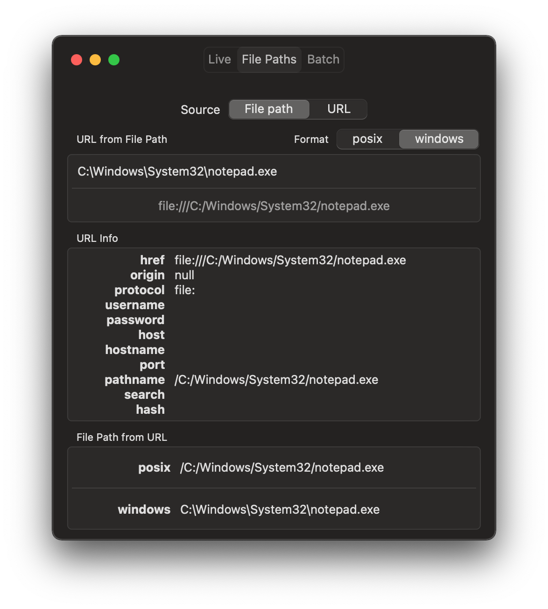

# WebURL Live Viewer

 

A tool for [swift-url](https://www.github.com/karwa/swift-url) with a similar interface to the [JSDOM live URL viewer](https://jsdom.github.io/whatwg-url/), which allows easy comparisons of WebURL with the JSDom reference implementation.

Requires macOS Catalina or newer.

The app contains a local copy of the JSDom live URL viewer website (in live-viewer/Resources/live-viewer/), which is loaded in to a WKWebView. Unfortunately, I haven't had any success getting it to work in a view-less JavascriptCore context (that would be invaluable for scripting purposes, generating/verifying additional test files for swift-url).

## Getting Started

1. Clone this repository
2. Clone the swift-url repository in to this one, so your folder structure looks like:

   - swift-url-tools/
      - live-viewer.xcworkspace
      - live-viewer/
        - viewer-app.xcodeproj
        - Sources/
        - Resources/
      - swift-url/
        - Sources/
        - Tests/
        - ...etc

Here's the command:

    git clone https://www.github.com/karwa/swift-url

(Yes, this is a bit clunky, but you get a much better testing & editing experience in Xcode when these are just 2 source projects on disk).

3. Open live-viewer.xcworkspace in XCode.
4. Build and run the "live-url-viewer" target.

Note: You can also run WebURL's own test suite from this same workspace by selecting the "swift-url Package" target.